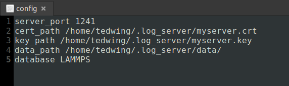

# Rust_Logger 

## A git-like utility for easily tracking file changes

My past experiences with computational experiments - in AI, physics, engineering, etc - have shown that it is very easy to lose track of what things have changed in your configs, code, or input data. At the start of a new moloecular dynamics project in mid-2022 I have decided that it is worth investing some time into creating a system which can effortlessly log any changes that might occur in a project.

You might ask "well why not use git?". You certainly could use git to track these types of changes but git is more meant for more significant code-base changes that are more or less permanent. In computational science you might want to only change 1 or 2 variables and see how that changes the result. This can quickly generate thousands of git commits that would be impossible to keep track of or analyze using vanilla git or github. As computational scientists we need to easily visualize the relationships between potentially thousands or millions of experimental inputs and outputs. This is what has motivated the current project.

## Contents

- [Rust_Logger](#rust_logger)
  - [A git-like utility for easily tracking file changes](#a-git-like-utility-for-easily-tracking-file-changes)
  - [Contents](#contents)
  - [How it works](#how-it-works)
  - [How it works - an example](#how-it-works---an-example)
  - [Setup - MongoDB](#setup---mongodb)
  - [Setup - log_server: Prerequisite TLS](#setup---log_server-prerequisite-tls)
  - [Setup - log_server](#setup---log_server)
  - [Setup - log_server config](#setup---log_server-config)

## How it works 
The current system is broken into 2 parts - the `log_client` and `log_server`. `log_client` is a utility for users or automated programs to upload results to the `log_server`. The `log_server` is a webserver+database combo that receives data from the `log_client` and inserts it into a local MongoDB database. The communication between the client and server is encrypted via TLS to maintain confidentiality.

## How it works - an example 
Once you have `log_server` set up somewhere and all the database/configuration settings are appropriately set, we can now begin using the `log_client`. 

The `log_client` manifests itself as a command-line tool called `log`. We first need to generate an account with our database. This account registration is triggered automatically the first time you use `log`:

This prompts you to enter the admin password of your Mongo database. After entering the correct password you should see the resulting messages:

Behind the scenes `log_client` has used this password to authenticate to the `log_server`. After authentication, the server generates a random key for your user and sends this key to the client. This key is stored in `/etc/.Rust_Logger_Credentials` as a file readable only by the root user of the system. This prevents unauthorized users from stealing this key and potentially accessing the database. Future interactions with the server are authenticated using this key file.

From the above output messages we can see the 3 main functions `log` can perform: `Execute and log`, `log`, and `clean`.

What exactly does the system log? Let's see an example. 

The original use-case of Rust_Logger was to manage the input/outputs of LAMMPS molecular dynamics simulations. I wanted a system that could run a simulation and then log all the inputs/outputs. This is the meaning of `Execute and log`. To do this with LAMMPS I could do the following from terminal:

>*For this I am referencing the `flow/` example in `lammps/examples/flow/` (note that I am running the below command from the same directory as the input file but this does not have to be the case. I can use the log utility to run a command from anywhere on the system assuming I provide the correct path to the input file/directory*).

`$ log lmp -in in.flow.couette`

Everything after the `log` command is simply what I would normally run for a LAMMPS simulation. Running this command we will see all the normal output from LAMMPS plus a few extra lines from the `log_client`:

The final line: `"Data received"` let's us know that the `log_server` has received our data. After the LAMMPS simulation finished, `log` compressed the input file's entire directory and sent it to the server. Let's see how that looks via Mongo Compass. 

The first things we see are several fields with `"upload_"` in the prefix. This is the associated metadata of the upload. `upload_path` gives the actual location where the compressed data now exists.

We can view the uploaded files in the `files` object:

The `log_server` actually only records certain file types that we add in the server config file. But the full contents of the original directory are still within `upload_path`. This way we can store all data without clogging the database with stuff that we might not care about.

>*Of course, depending on the outputs from our simulations we may be using up a lot of disk space. This can easily be changed in the future by restricting what is uploaded.*

Now let's say we make a modification to our input file `in.flow.couette`. The next time we run a simulation this change will be noted by the system.

However this time we can skip the simulation and just upload the folder directly- an example of the `log` functionality:

`$ log -c -in in.flow.couette`

This will just upload the directory without running any other external programs. In Mongo we can now inspect the `diffs` object of this newly inserted document:

We see the equivalent of a git diff of the file and see that `"# an extra line"` was added to the file.

>*This summarizes the basic functionality of the Rust_Logger. It is not enough to know the changes of our files, we also need to track certain quantities that we want to measure like maybe energy, conductivity, etc. This is explained in another part of the documentation*

## Setup - MongoDB
Rust_Logger depends on a MongoDB database for it's backed. Currently this database must be installed and configured manually by you, the user. However, this does not require much work. We only need to set up a Mongo server with basic authentication settings. 

The MongoDB documentation is very good and can be found at the following links:

- Installation on Ubuntu: https://www.mongodb.com/docs/manual/tutorial/install-mongodb-on-ubuntu/
- Authentication setup: https://www.mongodb.com/docs/manual/tutorial/configure-scram-client-authentication/
- (optional) Security checklist: https://www.mongodb.com/docs/manual/administration/security-checklist/

The above links should be enough to setup a Mongo database for our purposes. Be sure to choose a good password for your admin user. This is needed later on.

## Setup - log_server: Prerequisite TLS
I will now describe the setup process of the `log_server`. `log_server` communicates with a `log_client` through http communication secured with TLS. This requires that the system running `log_server` contain an unexpired, valid TLS certificate. 

Now if you are running `log_server` on a local network you will need to create a self-signed certificate and manually add the certificate to all client machines' trusted lists. I describe how to do this in `log_server/Creating self-signed certificates.txt` but you can also find plenty of manuals on how to do this online. 

If however you are running the server on a internet-accessible server, then you likely already have a valid TLS certificate provided by an organization like Let's Encrypt (https://letsencrypt.org/). You can then use this certificate and not have to worry about modifying your clients' trust lists. 

## Setup - log_server
Installing the `log_server` is quite trivial. Just run the install script at `log_server/install.sh`:

This will install the executable `tls_server` to `/usr/bin/` and attempt to start the service as `log_server.service`. It will of course fail because it does not know where your TLS certificates are located.

## Setup - log_server config
As the printed install messages indicate, you must first set up the server config. This will be located in a new hidden folder in your home directory called `.log_server/config`. It looks like this:

Not much going on there. The options are pretty self-explanatory but I will explain them here:

- `server_port` - The port where your server will listen for http requests from clients. Could be anything you want but probably want it above 1023 to avoid colliding with the [Well-known ports](https://en.wikipedia.org/wiki/List_of_TCP_and_UDP_port_numbers#Well-known_ports).
- `cert_path` - Location of TLS certificate. Point to wherever your self-signed crt file is located - or if have a certificate from Lets Encrypt yours will be at `/etc/letsencrypt/live/<your domain name>/fullchain.pem`.
- `key_path` - Location of TLS private key. Point to wherever your self-signed key file is located - or if have a certificate from Lets Encrypt yours will be at `/etc/letsencrypt/live/<your domain name>/privkey.pem`.
- `data_path` - Location where uploaded files will be stored on disk. The default location should be fine.
- `database` - Name of the MongoDB database that the server will create for you. This also can be anything you want. 