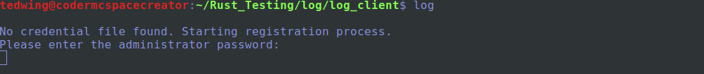

# Rust_Logger 
## A git-like utility for easily tracking file changes

My past experiences with computational experiments - in AI, physics, engineering, etc - have shown that it is very easy to lose track of what things have changed in your configs, code, or input data. At the start of a new moloecular dynamics project in mid-2022 I have decided that it is worth investing some time into creating a system which can effortlessly log any changes that might occur in a project.

You might ask "well why not use git?". You certainly could use git to track these types of changes but git is more meant for more significant code-base changes that are more or less permanent. In computational science you might want to only change 1 or 2 variables and see how that changes the result. This can quickly generate thousands of git commits that would be impossible to keep track of or analyze using vanilla git or github. As computational scientists we need to easily visualize the relationships between potentially thousands or millions of experimental inputs and outputs. This is what has motivated the current project.

## How it works
The current system is broken into 2 parts - the `log_client` and `log_server`. `log_client` is a utility for users or automated programs to upload results to the `log_server`. The `log_server` is a webserver+database combo that receives data from the `log_client` and inserts it into a local MongoDB database. The communication between the client and server is encrypted via TLS to maintain confidentiality.

## How it works - an example
Once you have `log_server` set up somewhere and all the database/configuration settings are appropriately set, we can now begin using the `log_client`. 

The `log_client` manifests itself as a command-line tool called `log`. We first need to generate an account with our database. This account registration is triggered automatically the first time you use `log`:

This prompts you to enter the admin password of your Mongo database. After entering the correct password you should see the resulting messages:

Behind the scenes `log_client` has used this password to authenticate to the `log_server`. After authentication, the server generates a random key for your user and sends this key to the client. This key is stored in `/etc/.Rust_Logger_Credentials` as a file readable only by the root user of the system. This prevents unauthorized users from stealing this key and potentially accessing the database. Future interactions with the server are authenticated using this key file.

From the above output messages we can see the 3 main functions `log` can perform: `Execute and log`, `log`, and `clean`.

What exactly does the system log? Let's see an example. 

The original use-case of Rust_Logger was to manage the input/outputs of LAMMPS molecular dynamics simulations. I wanted a system that could run a simulation and then log all the inputs/outputs. This is the meaning of `Execute and log`. To do this with LAMMPS I could do the following from terminal:

>*For this I am referencing the `flow/` example in `lammps/examples/flow/` (note that I am running the below command from the same directory as the input file but this does not have to be the case. I can use the log utility to run a command from anywhere on the system assuming I provide the correct path to the input file/directory*).

`$ log lmp -in in.flow.couette`

Everything after the `log` command is simply what I would normally run for a LAMMPS simulation. Running this command we will see all the normal output from LAMMPS plus a few extra lines from the `log_client`:

The final line: `"Data received"` let's us know that the `log_server` has received our data. Let's see what that is via Mongo Compass. 

The first things we see are several fields with `"upload_"` in the prefix. This is the associated metadata of the upload. The `files` object is what holds the actual important bits that we care about.

