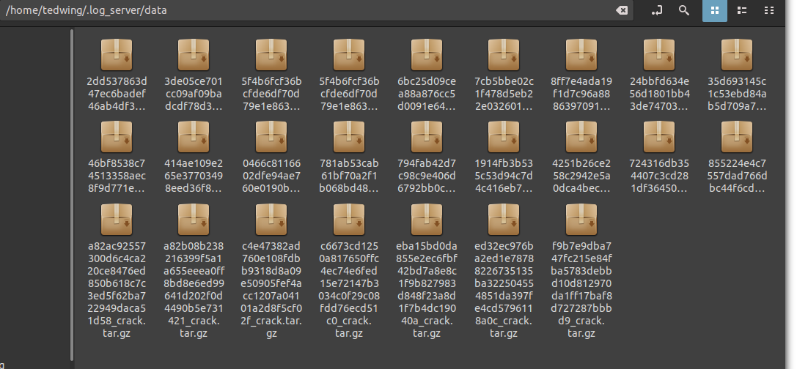

# Rust_Logger 

## A git-like utility for easily tracking file changes

My past experiences with computational experiments - in AI, physics, engineering, etc - have shown that it is very easy to lose track of what things have changed in your configs, code, or input data. At the start of a new moloecular dynamics project in mid-2022 I have decided that it is worth investing some time into creating a system which can effortlessly log any changes that might occur in a project.

You might ask "well why not use git?". You certainly could use git to track these types of changes but git is more meant for more significant code-base changes that are more or less permanent. In computational science you might want to only change 1 or 2 variables and see how that changes the result. This can quickly generate thousands of git commits that would be impossible to keep track of or analyze using vanilla git or github. As computational scientists we need to easily visualize the relationships between potentially thousands or millions of experimental inputs and outputs. This is what has motivated the current project.

## Contents

- [Rust_Logger](#rust_logger)
  - [A git-like utility for easily tracking file changes](#a-git-like-utility-for-easily-tracking-file-changes)
  - [Contents](#contents)
  - [Quick Help](#quick-help)
    - [`Commands`:](#commands)
    - [`watch` file schema:](#watch-file-schema)
  - [How it works](#how-it-works)
  - [Setup - MongoDB](#setup---mongodb)
  - [Setup - log_server: Prerequisite TLS](#setup---log_server-prerequisite-tls)
  - [Setup - log_server](#setup---log_server)
  - [Setup - log_server config](#setup---log_server-config)
  - [Setup - log_client](#setup---log_client)
  - [Setup - log_client config](#setup---log_client-config)
  - [`log` - the command-line utility](#log---the-command-line-utility)
  - [`log` - registration](#log---registration)
    - [Usage:](#usage)
  - [`log` - upload](#log---upload)
    - [Usage:](#usage-1)
  - [Example](#example)
  - [`log` - `watch` file](#log---watch-file)
  - [`log` - `dump` files](#log---dump-files)
  - [log - clean](#log---clean)

## Quick Help
### `Commands`:
>*User input is denoted by angle brackets <>*

- `log <lammps command>` - will execute `<lammps command>` and upload results to server. Command must include "-in" followed by a lammps input file. 
  - Example: `log mpirun -np 4 lmp -in in.crack`
- `log -c < file / directory / . >` - Will compress and upload current directory to server. If given a file, will compress the directory containing said file.
  - Example: `log -c lammps/examples/crack/`
- `log clean` - Will remove any "dead" files deleted from database but still on the server filesystem.
  - Example: `log clean`

### `watch` file schema:

```json
{
  "<file name>": 
  {

    "upload": "bool",

    "variables": 
    {
      "<variable name: string>":
      {
        "type": "<type>"
      }
    }
  },

  "dump": 
  {
    "parse": "bool"
  }

}
```
Valid types are:

- string
- long_string
- float
- int
- thermo_log

And yes I know that JSON doesn't have boolean types, for `"bool"` I actually mean `1/0` for `true/false`, respectively.

## How it works 
The current system is broken into 2 parts - the `log_client` and `log_server`. `log_client` is a utility for users or automated programs to upload results to the `log_server`. The `log_server` is a webserver+database combo that receives data from the `log_client` and inserts it into a local MongoDB database. The communication between the client and server is encrypted via TLS to maintain confidentiality.

## Setup - MongoDB
Rust_Logger depends on a MongoDB database for it's backed. Currently this database must be installed and configured manually by you, the user. However, this does not require much work. We only need to set up a Mongo server with basic authentication settings. 

The MongoDB documentation is very good and can be found at the following links:

- Installation on Ubuntu: https://www.mongodb.com/docs/manual/tutorial/install-mongodb-on-ubuntu/
- Authentication setup: https://www.mongodb.com/docs/manual/tutorial/configure-scram-client-authentication/
- (optional) Security checklist: https://www.mongodb.com/docs/manual/administration/security-checklist/

The above links should be enough to setup a Mongo database for our purposes. Be sure to choose a good password for your admin user. This is needed later on.

## Setup - log_server: Prerequisite TLS
I will now describe the setup process of the `log_server`. `log_server` communicates with a `log_client` through http communication secured with TLS. This requires that the system running `log_server` contain an unexpired, valid TLS certificate. 

Now if you are running `log_server` on a local network you will need to create a self-signed certificate and manually add the certificate to all client machines' trusted lists. I describe how to do this in `log_server/Creating self-signed certificates.txt` but you can also find plenty of manuals on how to do this online. 

If however you are running the server on a internet-accessible server, then you likely already have a valid TLS certificate provided by an organization like Let's Encrypt (https://letsencrypt.org/). You can then use this certificate and not have to worry about modifying your clients' trust lists. 

## Setup - log_server
Installing the `log_server` is quite trivial. Just run the install script at `log_server/install.sh`:


This will install the executable `tls_server` to `/usr/bin/` and attempt to start the service as `log_server.service`. It will of course fail because it does not know where your TLS certificates are located.

## Setup - log_server config
As the printed install messages indicate, you must first set up the server config. This will be located in a new hidden folder in your home directory called `.log_server/config`. It looks like this:

```
server_port 1241
cert_path /home/tedwing/.log_server/myserver.crt
key_path /home/tedwing/.log_server/myserver.key
data_path /home/tedwing/.log_server/data/
database LAMMPS
```

Not much going on there. The options are pretty self-explanatory but I will explain them here:

- `server_port` - The port where your server will listen for http requests from clients. Could be anything you want but probably want it above 1023 to avoid colliding with the [Well-known ports](https://en.wikipedia.org/wiki/List_of_TCP_and_UDP_port_numbers#Well-known_ports).
- `cert_path` - Location of TLS certificate. Point to wherever your self-signed crt file is located - or if have a certificate from Lets Encrypt yours will be at `/etc/letsencrypt/live/<your domain name>/fullchain.pem`.
- `key_path` - Location of TLS private key. Point to wherever your self-signed key file is located - or if have a certificate from Lets Encrypt yours will be at `/etc/letsencrypt/live/<your domain name>/privkey.pem`.
- `data_path` - Location where uploaded files will be stored on disk. The default location should be fine.
- `database` - Name of the MongoDB database that the server will create for you. This also can be anything you want. 

After this is properly set up we can start the service with systemctl:


## Setup - log_client
With a server now running we can now move to setting up a `log_client`. This is considerably simpler since there are no prequisites or services running. Again here there is also a `install.sh` script- but this time in the `log_client/` folder:


Considerably less flashy than the server install. 

## Setup - log_client config
This also installs a config to a hidden folder in the home folder at `~/.log/config`:

```
Username tayg
Server localhost:1241
tracked_files in.
```

Even more boring than the server config!

- `Username` - The username that will register this machine with the server. Set it to whatever you want
- `Server` - This is the site + port of the machine  where the `log_server` is running. So if the server was running at example.com on port 1241 I would put `example.com:1241` here.
- `tracked_files` - This denotes a list of filetypes that `log_client` should monitor for changes. This can be a file extension, file prefix, or just some common substring found in your files. Different types are separated by spaces so to track multiple files this would look like "`tracked_files .log .txt .csv`"

This covers the basic setup required for Rust_Logger to operate. You should now be able to run examples like the one shown earlier in [How it works - an example](#how-it-works---an-example).

## `log` - the command-line utility
When you run the `log_client` install script, you are actually installing a tool called `log` which can run from the linux terminal. `log` is what you use for all interactions with Rust_Logger. I will now explain each of its core functions.

## `log` - registration
>*The following is not essential for the actual usage of Rust_Logger but may be helpful for your overall understanding of the program. But feel free to skip if you are impatient.*

### Usage: 

`log <anything>`

When you first run `log` on a system, you cannot actually access the database to insert or read documents bc the system does not have a valid account. The first thing that `log` does is to ask you for the admin password of the Mongo database. This would have been setup in the [Setup - MongoDB](#setup---mongodb) phase. The system will then use this password to authenticate to the server, which will then create a new user with full access to the `database` given in the server config. The username is the same `username` from the client config. 

The server returns an API key which is then stored on you client machine as `/etc/.Rust_Logger_Credentials`. Only the root user on your client system can access this file. `log` is an SUID binary which temporarily obtains root privileges to read from this file. All other operations occur with your usual user permissions.

This username + API key is what is used to further authenticate the client system to the server. 

If everything runs properly this whole process is nearly instantaneous and unnoticeable to the end-user.

## `log` - upload
>*You absolutely MUST read this to be able to use the Rust_Logger in any meaningful way.*

### Usage:

`log -c <file or directory>`

or

`log <lammps command>`

We now get to the real meat of the Rust_Logger. I think it is best to show how it works through an example.

## Example

Let's start with a simple example from the LAMMPS molecular dynamics repository. Because of it's funny name I have been testing all of this with the `crack` simulation (it simulates a crack forming between atoms). Here we see the directory containing the input file:


Pretty boring. Just a simple input script. I can run the simulation easily with 

`lmp -in in.crack`

Doing that will generate an output file - log.lammps.


We would like to log this information with `log`. We can easily do this with:

`log -c .`

This will log the entire directory. But it has also created a new file in the directory:


The REV file (short for "revision") is how the logger keeps tracks of changes made in the directory. It does this by recording hashes of the files in the directory. When you run `log` again it recalculates these hashes to see if they are different from what is in the REV file. If so, then `log` knows that there has been a change and that this needs to be recorded.

Let's look at what the previous command uploaded to Mongo:


From `upload_name` it looks like we have uploaded a compressed tar.gz version of the directory- which is exactly what has occurred. The `log_client` simply compresses the entire directory and sends it to `log_server`. 

Below that we also see `id` and `parent_id`. These fields are used to track changes between simulations and track the progress of these changes. `id` is simply a combined hash of all files in the directory, with the directory name prepended (that's also the MongoDB collection name). `parent_id` is the id of the previous version of this simulation. Since this was the first upload to this collection, the `parent_id` is `*` which lets us know that this is the root entry.

If you try to log the directory again we are given an error from `log`:


The `log_server` uses the `upload_hash` to stop us from sending the exact set of files twice. `upload_hash` is a hash of the uploaded tar.gz file. Since we have made no changes, this hash has not changed.

Let's see what happens when add a new arbitrary file:


This generate no errors. Let's look at the result in Mongo:


We see a new entry with a different `upload_hash` from the first upload, but the `id` and `parent_id` are unchanged. Why is this? Remember that `tracked_files` config setting? You can check it here [Setup - log_client config](#setup---log_client-config). By default Rust_logger will only monitor `in.` files which are the common prefix for LAMMPS input files. Only changes to these files will trigger an update of the `id` fields.

Let's change the input file by changing the timestep from 0.003 to 0.001 and then reupload:


The second entry shows a new `id` and the `parent_id` matches the previous run's `id`.

Rust_Logger also records the specific changes that are made. This is recorded in the `diffs` object:


We can also access the entire input file directly in the `files` object:


`log` will prevent a drop in the revision chain by erroring if it cannot find the parent of your current directory. If I were to delete everything in our new `crack` collection on MongoDB and then try to reupload the directory I would get the following message:


This error can only occur if something was deleted in the MongoDB. To fix this you will need to delete the current REV file so that `log` can start a new branch.


## `log` - `watch` file
Within the `files` object we can also see the REV file here. But notice that the other files - `log.lammps` and `test_file` - are not present. This is because these file types are not on the `tracked_files` list. However, there is a way for us to tell `Rust_Logger` to monitor them.

The purpose of Rust_Logger is not just monitor to files changes, but to also record specific simulation outputs. We can tell Rust_Logger to monitor certain outputs through the use of the `watch` file. 

The `watch` is actually a kind of schema that we define using JSON. We use it to define what additional files we want to upload to the `log_server` and specific variables that we might want to track from our simulation outputs. It is added to the directory by the user:


For our current `crack` example, a `watch` file might look like this:

```json
{
  "log.lammps": 
  {

    "upload": 1,

    "variables": 
    {
      "atom_style":
      {
        "type": "string"
      },

      "timestep":
      {
        "type": "float"
      },

      "dimension":
      {
        "type": "int"
      },

      "pair_style":
      {
        "type": "long_string"
      },

      "thermo_data": 
      {
        "type": "thermo_log"
      }  
    }

  }
}
```
>*If your eyes have glazed over, that's ok. The author is thinking of how to make this more user-friendly*

The `watch` file is made up of different objects where the outermost key is the filename. This tells `log_server` to pay attention to this particular file. In this case we only reference one file: `log.lammps`.

Within the file object we have 2 parameters `"upload"` and`"variables"`. `"upload"` is a boolean which tells `log_server` whether or not to include the entire file in the `files` object within the database. 

`"variables"` is a list that tells `log_server` fields to extract from the file. It does this by looking for the appearance of the variable string within the file, and sthen extracting the value that appears after the string on the same line. We tell `log` the variable type with the `"type"` key.

The variables given here may not be useful in any output analysis but they give examples of every possible type currently supported in Rust_Logger. Here is the corresponding entry within mongo:


`"thermo_log"` is a special type which refers to the thermodynamic data printed by LAMMPS:


In the database it looks like this:


>*You might be wondering, "well, what if I have multiple occurences of the same string in my output files? How will Rust_Logger handle those?"  
> The answer is ... it doesn't. It will just use the last appearance of that variable for the value it logs.  
> However the thermo_log type can accurately handle this situation by making as many thermo_log entries as needed.*

## `log` - `dump` files
It is possible to log dump files with Rust_Logger as well. In the `watch` file you can `"dump"` as a file.

```json
{
  "log.lammps": 
  {
    ...
  },

  "dump": 
  {
    "parse": 1
  }
}
```

The `"parse"` option tells the logger to parse the dump file into a large dump object. Otherwise, the entire dump file will be just  uploaded as a single string. And example in Mongo is shown below:


Compared to the original file:


>*Note this is very much a work in progress and every possible LAMMPS parameter may not be parsed correctly. For example, it is known that BOX BOUNDS is definitely not handled correctly.*

>*It is also not recommended to try and view dump file outputs through MongoDB Compass. The large size of the dump files makes the interface very laggy. However, querying the dump file data through other means is quite fast.*

## log - clean
One final aspect of the Rust_Logger is the file storage. When you log a directory with `log` it sends a compressed version of the directory to the server. These files reside in the `data` folder specified in the `data_path` config:



This allows you to easily retrieve any of the files if desired. 

However sometimes you may want to delete something from the MongoDB. This will not trigger an removal of the actual file from the server filesystem. To clear out these "dead" files, you can run the `log clean` command. This will prompt you for the Mongo admin password and then go find all the files within `data_path` which no longer have a matching entry in the database. These files are then deleted. 